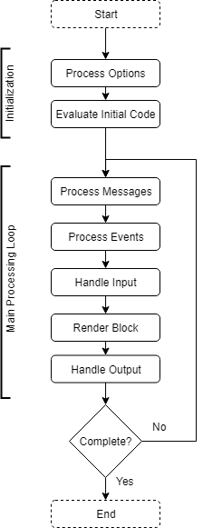

# Session Lifecycle

The following describes the basic lifecycle for a live coding session. 

## Basic Audio Engine Lifecycle

The following diagram shows the basic processing flow for an audio engine. The diagram shows the two main phases of initialization and runtime and will be further explained in the sections below.  

## Initialization

When a users begins a session, they start their audio engine with a given set
of options. These options may be commandline flags, saved program settings,
or other sources of configuration. The program starts by processing these
options and configuring the engine for runtime.

Next, any initial code is evaluated. For example, a CSD document is often
provided to Csound as the project to render. This initial code may describe
fully everything that will be rendered--as is the case when creating
non-realtime projects meant to render to disk--or it may be a basic setup for
a realtime performance.

In the case of csound-live-code, this project provides a main livecode.orc
file that contains the entire library of code for the project. There is also
a livecode.csd file provided that #include's livecode.csd and configures some
other options. One can use the CSD file as the initial code when working on a
desktop system so that when Csound enters its main rendering loop, it will be
ready for live coding.

## Runtime

Once the engine is initialized we start the engine main main processing loop.
The main loop in audio engines may differ in exact features (e.g., some audio
engines to not include schedulers) and implementation, but the above diagram
applies generally to most engines.

### Handle Messages

Messages are data structures that describe some operation for the engine to
perform. These messages are sent to the engine and put into a message inbox
(e.g., a lock-free queue) where they will be waiting until the engine takes
the new messages from the queue and processes them.

Messages may come in different forms and through diffrent channels. For
example, an engine like Csound has queues for incoming MIDI data, OSC data,
pending code evaluations, incoming score data, and so on.

### Process Events

Engines, such as Csound, that have schedulers will next process events.
Events are like messages in that they describe an operation for the engine to
perform, but they are also time-tagged with a start time. When the engine
goes to process events, it checks events' start times and compares it to the
currenting engine time to determine if an event should fire an action and be
removed from the queue. Events may do things like execute code, instantiate
and start running new instruments, and more.

Events are generally an abstraction exposed to users that they will use
directly, while messages are usually an internal implementation matter by
which the engine operates.

### Input, Render Block, Output

Finally, the engine transfers incoming data into the engine (e.g., reading
audio input from a sound card), renders a block of processing (e.g., generate
and process 32 samples of data; internally schedule new events), and
transfers outgoing data from the engine (e.g., writing audio output to a
sound card). When this is done, the engine checks if runtime should stop. If
so, the engine performs cleanup operations and exits; if not, return to the
beginning of the loop and continue on.

## A Note about Engines

Engines generally use either a _single-sample_ or _block_ processing model.
In the former, the main loop would execute once for every sample of audio,
while in the latter, the loop would execute once for some set number of
samples (e.g., using ksmps=32 in a Csound project tells Csound to process 32
samples at a time). Because the message and event processing happens every
sample, the timing of events and messages can be more accurate than block
processing. The trade off is that block processing generally gives better
performance (better data locality for processing, more operations done on the
stack rather than the heap, less function call overhead).
